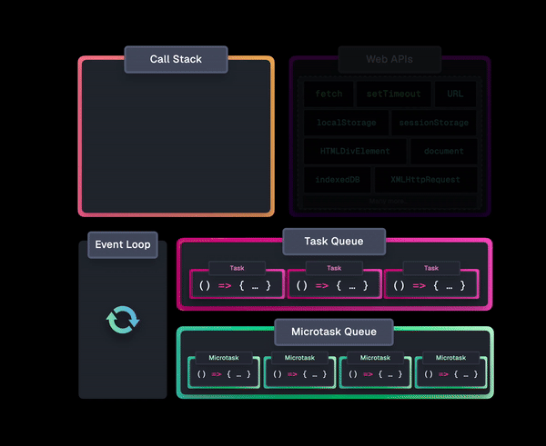
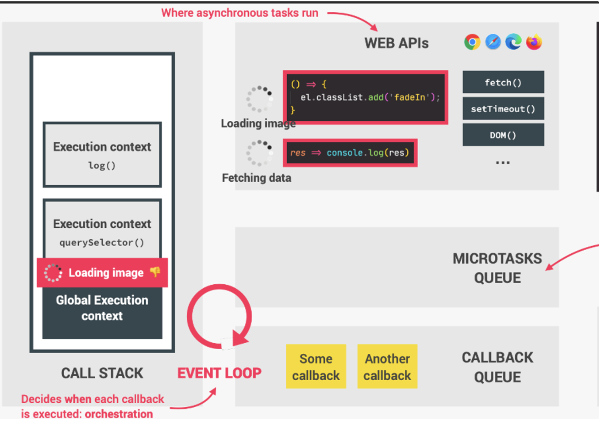

## Questions on asynchronous javascript 

#### Q1:What is the call stack ?

**Answer**:The `Call Stack` manages the execution of our program. When we invoke a function, a new execution context gets created which gets pushed onto the `Call Stack`. The top-most function in the call stack is evaluated, which could in turn invoke another function, and so on.

An execution context is popped off the `Call Stack` when the function completed its execution.

#### Q2:what are web APIs

**Answer**:Web APIs are functionalities provided to the engine, but are not part of the JavaScript language itself.

#### Q3:How does javascript gets access to the web apis

**Answer**:javascript gets access to the web api’s through the global window object 

#### Q4:Give 3 examples of web APIs 

**Answer**:fetch(),setTimeOut(),DOM()

#### Q5:Where does asynchronous tasks run in javascript

**Answer**:in web apis 

#### Q6:What is a callback queue ?

**Answer**:Ready to be executed callback functions

#### Q7:What is the MicroTasks Queue ?

**Answer**:Like callback queue but for callbacks related to promises .Has priority over call back queue

#### Q8:What is the event loop ?

**Answer**:Sends callbacks from callbackqueue and microtasks queue to call stack (decides when each call backback is executed)

#### Q9:What is the order in which event loop sends tasks from the Task Queue(or Callback Queue) and the microTask Queue

**Answer**:When the `Call Stack` is empty, the `Event Loop` first processes *all* microtasks from the `Microtask Queue` before moving on to the `Task Queue`.

After completing a single task from the `Task Queue`, and the `Call Stack` is empty, the `Event Loop` effectively "starts over" by processing *all* microtasks in the `Microtask Queue` before again moving on to the next task.



#### Q10:Draw a picture of javascript runtime in the browser

**Answer**:

#### Q11:What is a promise ? 

**Answer**:Promises are objects that represent the *eventual outcome* of an asynchronous operation.

#### Q12:What are the 3 states of a Promise object

**Answer**:A Promise object can be in one of three states:

- **Pending**: The initial state— the operation has not completed yet.
- **Fulfilled**: The operation has completed successfully and the promise now has a *resolved value*.
- **Rejected**: The operation has failed and the promise has a reason for the failure. This reason is usually an Error of some kind.

We refer to a promise as *settled* if it is no longer pending— it is either fulfilled or rejected

#### Q13:Construct a Promise Object 

**Answer**:

```js
const executorFunction = (resolve, reject) => {

  if (someCondition) {

    resolve("I resolved!");

  } else {

    reject("I rejected!");

  }

};

const myFirstPromise = new Promise(executorFunction);
```

#### Q14:Promise.all()

**Answer**:Promise.all() accepts an array of promises as its argument and returns a single promise. That single promise will settle in one of two ways:

- If every promise in the argument array resolves, the single promise returned from Promise.all() will resolve with an array containing the resolve value from each promise in the argument array.
- If any promise from the argument array rejects, the single promise returned from Promise.all() will immediately reject with the reason that promise rejected. This behavior is sometimes referred to as *failing fast*.

```javascript
let myPromises = Promise.all([

  returnsPromOne(),

  returnsPromTwo(),

  returnsPromThree(),

]);

myPromises

  .then((arrayOfValues) => {

    console.log(arrayOfValues);

  })

  .catch((rejectionReason) => {

    console.log(rejectionReason);

  });
```

#### Q15:What is failing fast  

**Answer**:Promise.all() accepts an array of promises as its argument and returns a single promise. That single promise will settle in one of two ways:

- If every promise in the argument array resolves, the single promise returned from Promise.all() will resolve with an array containing the resolve value from each promise in the argument array.
- If any promise from the argument array rejects, the single promise returned from Promise.all() will immediately reject with the reason that promise rejected. This behavior is sometimes referred to as *failing fast*.

#### Q16:What happens when a Promise constructor is called (internally)

**Answer**:a promise object is created .The promise object has several slots They are ➖

1. Promise State
2. Promise Result
3. PromiseIsHandled
4. PromiseFulfillReactions
5. PromiseRejectReactions

a promise capability record is also created

#### Q17:What happens internally to the Promise object which is created when we execute below code 

```javascript
new Promise((resolve, reject) => {

  resolve("done");

});
```

**Answer**:

`PromiseState` is set to fulfilled

`PromiseResult` is set to the value we passed to the resolve which is “Done” in this case

#### Q18:What happens internally to the Promise object which is created when we execute below code 

```js
new Promise((resolve, reject) => {

  reject("done");

});

```

**Answer**:

`PromiseState` is set to rejected

`PromiseResult` is set to the value we passed to reject which is “done”

#### Q19:What happens internally when we execute the below code ?

```js
new Promise((resolve, reject) => {

  reject("done");

}).then((result) => console.log(result));

```

 **Answer**:

`PromiseState` is set to fulfilled

`PromiseResult` is set to the value we passed to resolve which is done in this case

then also returns a promise so we can chain multiple then together

then creates a Promise Reaction Record (`PromiseFulfillReactions`) contains among other fields a handler property that holds the callbacks we passed to then .When the promise resolves the handler is added to the microtask queue and has access to the value with which the promise resolves (When the promise resolves this handler receives the value of PromiseResult as its argument after which its pushed to the microtask queue)

#### Q20:What happens internally when we execute below code ?

```js
new Promise((resolve, reject) => {

  reject("done");

}).catch((result) => console.log(result));

```

 **Answer**:

`PromiseState` is set to rejected

`PromiseResult` is set to the value we passed to resolve which is done in this case

catch also returns a promise so we can have a  then after catch

catch creates a Promise Reaction Record (`PromiseRejectReactions`) contains among other fields a handler property that holds the callbacks we passed to then .When the promise rejects the handler is added to the microtask queue and has access to the value with which the promise resolves (When the promise rejects this handler receives the value of PromiseResult as its argument after which its pushed to the microtask queue)