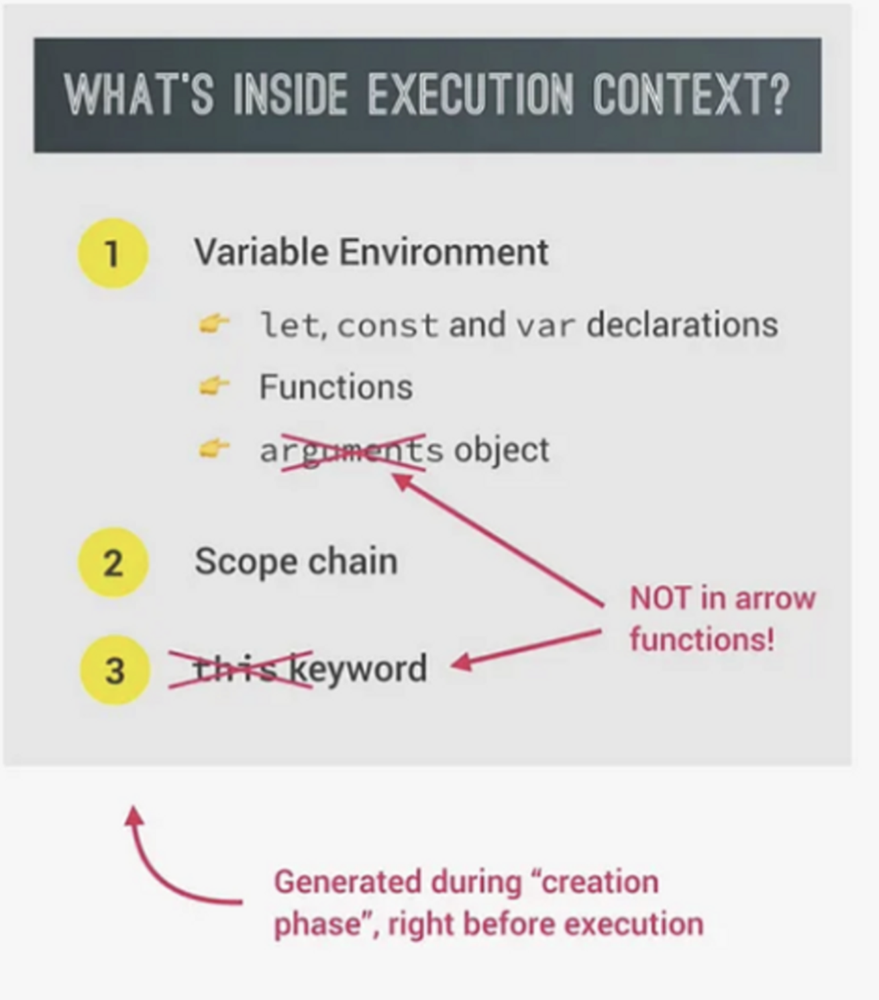

## Execution Context

#### Q1:Whats inside Execution context ? 

**Answer**:The follwing table illustrates whats inside the execution context 

#### Q2:What is the call stack ? 

**Answer**: Call stack is a “place” where execution contexts get stacked on top of each other, in order to keep track of where we are in the program’s execution (the order of execution).

#### Q3:What is the Execution Context ? 

**Answer**:Execution Context is an environment in which a piece of JavaScript is executed. It stores all the necessary information for some code to be executed, such as local variables or arguments passed into a function. JavaScript code always runs(computer CPU processing the received machine code) inside an execution context.

#### Q4:What is the Global Execution Context ? 

**Answer**:`Global execution context(EC)` is created for top-level code, the code that is not inside any function. So in the beginning, only the code that is outside of functions will be executed.

In any JavaScript project, no matter how large it is, there’s only **one global execution context**. It’s always there as the default context, where top-level code will be executed.

When the top-level code execution is finished, functions finally start to execute as well. **For each and every function call, a new execution context is created, one execution context per function,** containing all the necessary information to run that function.

All these execution contexts together make up the `call stack`.

#### Q5:The Execution Context in Javascript is created in two phases, they are -

**Answer**:The Execution Context in Javascript is created in two phases, they are -

1.Memory Creation Phase

2.Code Execution Phase