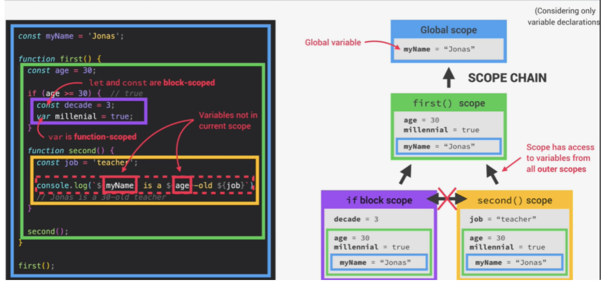

## Scoping Questions 

#### Q1: What is scope ? 

**Answer**: *Scope* controls where you can access a particular variable and where you can't access them

#### Q2: What Scoping does Javascript use 

**Answer**: JS uses *Lexical Scoping*, which means that scoping is controlled by the physical placement of functions and blocks in the code.

#### Q3:What are the three types of scope that javascript has ? 

**Answer**: In JS, we have 3 types of scope: *global* scope, *function* scope, and *block* scope.

#### Q4:What do you mean by the statement let/const are block scoped whereas var is function scoped

**Answer**:only variables declared with let or const are restricted to the block in which they are created. That means that a variable that is declared using a var would be scoped to the parent function, or else the global scope. Hence, we say that let and const are *block scoped* whereas var is function scoped

#### Q5:What is lexical scoping ? 

**Answer**:JS uses Lexical Scoping, which means that scoping is controlled by the physical placement of functions and blocks in the code.

#### Q6: Draw the scope chain of the following piece of code (considering only variable declaration)

```javascript
const myName = "Jonas";

function first() {

  const age = 30;

  if (age >= 30) {

​    const decade = 3;

​    var millenial = true;

  }

  function second() {

​    const job = "Teacher";

​    console.log(`${myName} is a ${age}-old ${job}`);

  }

  second();

}

first();
```

**Answer**: The follwing diagram shows the scope chain 



#### Q7:What will be the ouput of below code snippet ? 

```js
function outerFunction() {

  console.log(a);

  var a = 10;

  innerFunction();

  function innerFunction() {

​    console.log(a);

​    console.log(window.a);

​    console.log(this.a);

  }

}

var a = 7;

var b = 3;

outerFunction();
```

**Answer**: The output will be `undefined 10 7 7`