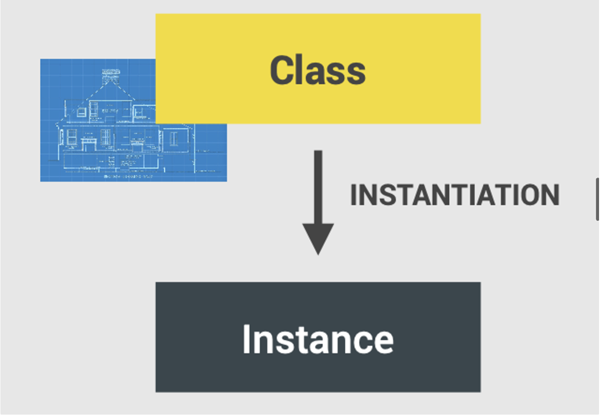
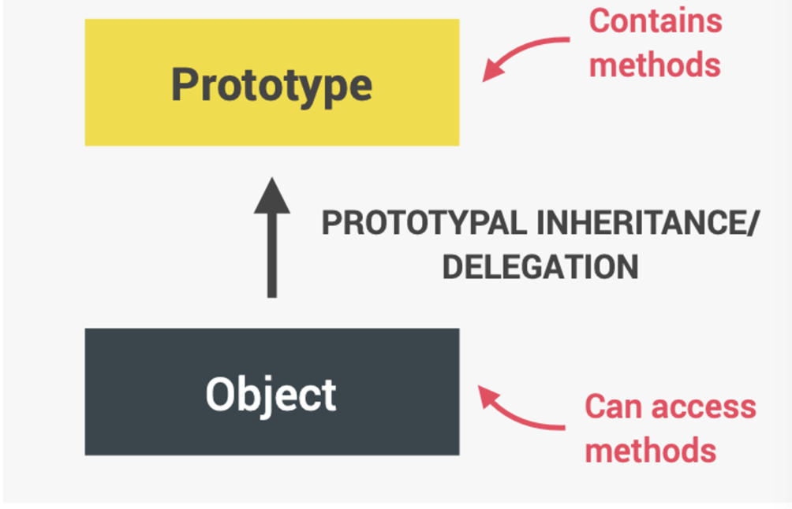

## Object Oriented Programming Questions

#### Q1:What is object oriented programming ?

**Answer**:The following are the salient points about object oriented programming :-

- object-oriented programming(oop) is a programming paradigm based on the concept of objects (paradigm ⇒ style of code , how we write and organize code)
- oop was developed with the goal of organizing code , to make it more flexible and easier to maintain(avoid spaghetti code)

#### Q2:Classes and instances in traditional oop 

**Answer**: class is like a blueprint from which we can create new objects 

#### Q3:What are the 4 fundamental principles of oop ?

**Answer**:The 4 fundamental principles of oop are the following :-

- Abstraction
  - Ignoring or hiding details that dont matter , allowing us to get an overview perspective of the thing we are implementing , instead of messing with details that dont really matter to our implementaion
- Encapsulation:
  - Keeping properties and methods private inside the class so they are not accessible from outside the class .Some methods can be exposed as a public interface(API)
- Inheritance
  - making all properties and methods of a certain class available to a child class , forming a hierarchical relationship between classes
- polymorphism
  - a child class can overwrite a method it inherited from a parent class

#### Q4:oop in javascript 

**Answer**:

✅ objects are linked to a prototype object

✅ Prototypal Inheritance : The prototype contains methods (behavior) that are accessible to all objects linked to that prototype

✅ Behavior (method) is delegeted to the linked prototype object

