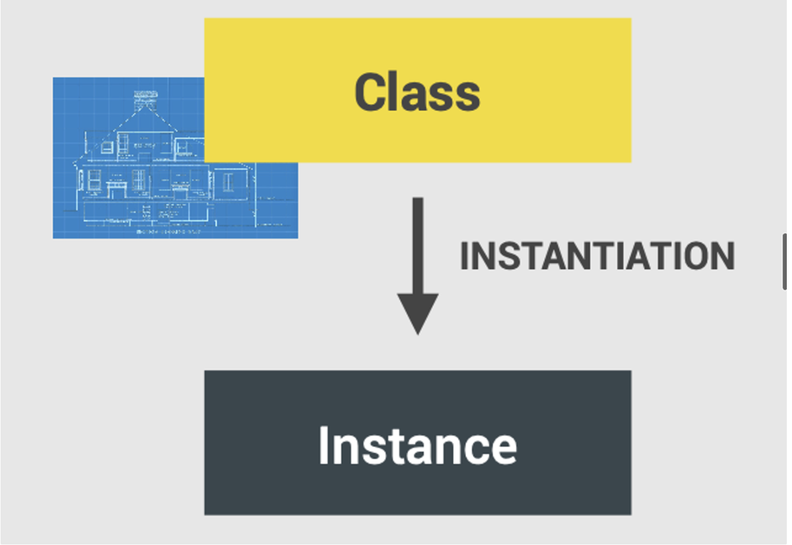
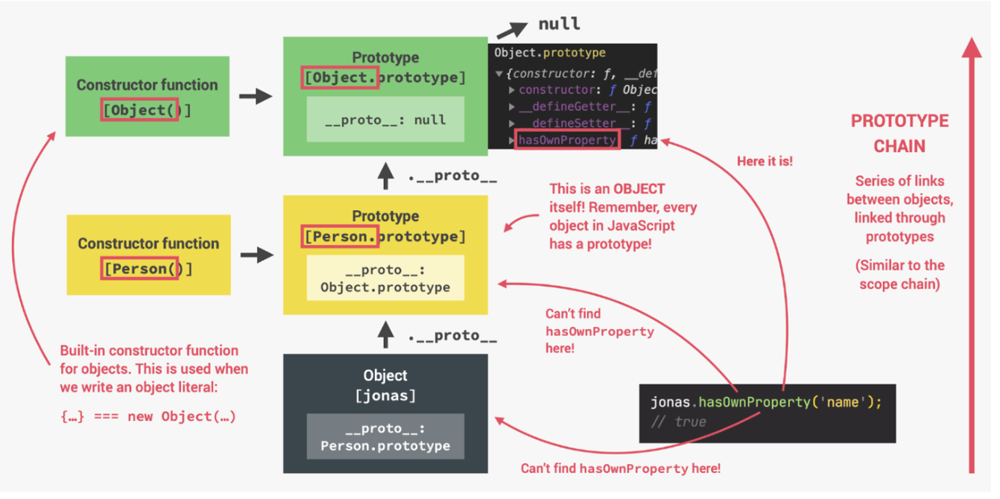
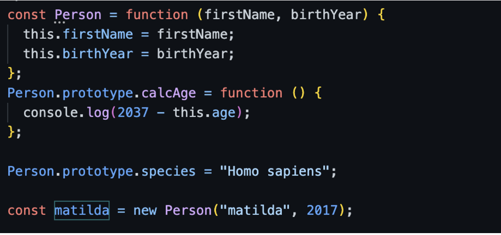
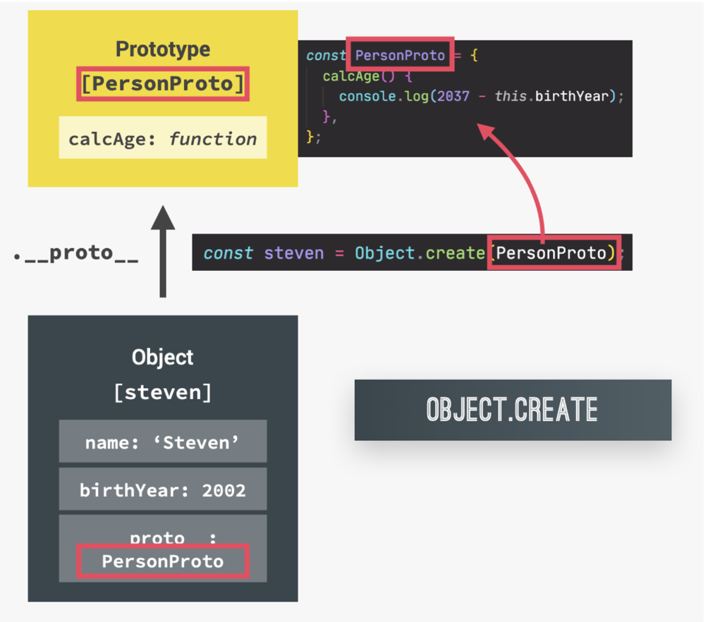

## Object Oriented Programming Theoretical Questions

#### Q1:What is object oriented programming ?

**Answer**:The following are the salient points about object oriented programming :-

- object-oriented programming(oop) is a programming paradigm based on the concept of objects (paradigm ⇒ style of code , how we write and organize code)
- oop was developed with the goal of organizing code , to make it more flexible and easier to maintain(avoid spaghetti code)

#### Q2:Classes and instances in traditional oop 

**Answer**: class is like a blueprint from which we can create new objects 



#### Q3:What are the 4 fundamental principles of oop ?

**Answer**:The 4 fundamental principles of oop are the following :-

- Abstraction
  - Ignoring or hiding details that dont matter , allowing us to get an overview perspective of the thing we are implementing , instead of messing with details that dont really matter to our implementaion
- Encapsulation:
  - Keeping properties and methods private inside the class so they are not accessible from outside the class .Some methods can be exposed as a public interface(API)
- Inheritance
  - making all properties and methods of a certain class available to a child class , forming a hierarchical relationship between classes
- polymorphism
  - a child class can overwrite a method it inherited from a parent class

#### Q4:oop in javascript 

**Answer**:

✅ objects are linked to a prototype object

✅ Prototypal Inheritance : The prototype contains methods (behavior) that are accessible to all objects linked to that prototype

✅ Behavior (method) is delegeted to the linked prototype object


#### Q5:What are the 3 ways of implementing prototypal inheritance in javascript ?

**Answer**:The 3 ways of implementing prototypal inheritance in js are the following

1.  constructor Functions
2. ES6 Classes
3. Object.create()

#### Q6:Create a Person Constructor function it has properties firstName and birthYear and a method calcAge , Create a object matilda from the Person Constructor with the values “matilda” and 2017 and then call the calcAge method ?  

**Answer**: The following code snippet shows the solution 

```js
function Person(firstName, birthyear) {

  this.firstName = firstName;

  this.birthyear = birthyear;

}

Person.prototype.calcAge = function () {

  console.log(2037 - this.birthyear);

};

const matilda = new Person("matilda", 2017);

matilda.calcAge();
```

#### Q7:Can arrow functions work as constructor functions ? 

**Answer**: no because they dont have this 

#### Q8:Why it is recommended to add methods on the prototype property of a constructor function instead of adding direcly in the constructor function

**Answer**:to save memory 

#### Q9:What are the steps performed when we call new Person("matilda",2017)

```js
const Person = function (firstName, birthYear) {

  this.firstName = firstName;

  this.birthYear = birthYear;

};

const matilda = new Person("matilda", 2017);
```

**Answer**: The following steps are performed

1. new {} is created
2. function is called ,this={}
3. {} linked to prototype
4. function automatically return {}

#### Q10:Draw the prototype chain 

```js
const Person = function (firstName, birthYear) {

  this.firstName = firstName;

  this.birthYear = birthYear;

};

Person.prototype.calcAge = function () {

  console.log(2037 - this.age);

};

const matilda = new Person("matilda", 2017);
```

**Answer**: The prototype chain is shown below 



#### Q11; What is prototypal inheritance ?

**Answer**: if a property or method cannot be found in a certain object javascript will look into its prototype

#### Q12: What is prototype chain ? 

**Answer**: Series of links between objects linked through prototypes 

#### Q13:Confirm the following : 

1. Person.prototype is prototype of matilda
2. species is not a property of matilda
3. matilda is a instance of Person



**Answer**:The answer is shown below 

```js
const Person = function (firstName, birthYear) {

  this.firstName = firstName;

  this.birthYear = birthYear;

};

Person.prototype.calcAge = function () {

  console.log(2037 - this.age);

};

Person.prototype.species = "Homo sapiens";

const matilda = new Person("matilda", 2017);

console.log(Person.prototype.isPrototypeOf(matilda));

console.log(matilda.hasOwnProperty("species"));

console.log(matilda instanceof Person);
```

#### Q14:What is at the top of the prototype chain ? 

**Answer**: `Object.prototype`

#### Q15:What does the constructor property on Person.prototype object point to ? 

```js
const Person = function (firstName, birthYear) {

  this.firstName = firstName;

  this.birthYear = birthYear;

};

Person.prototype.calcAge = function () {

  console.log(2037 - this.birthYear);

};
```

**Answer**:It points back to the constructor function

#### Q16:Create a class Person which has the following properties firstName and birthYear .It has a method calcAge() which logs to the console 2037-birthYear

**Answer**: The code snippet is shown below 

```js
class Person {

  constructor(firstName, birthYear) {

    this.firstName = firstName;

    this.birthYear = birthYear;

  }

  calcAge() {

    console.log(2037 - this.birthYear);

  }

}
```

#### Q17:“All of the methods that we write in a class (outside of the constructor) is added to the prototype property of the class i.e if the class is Person it will be added to Person.prototype “ Is the above statement correct ? 

**Answer**: yes

#### Q18:Suppose we have a class Person , it has properties and methods can we add methods on the  Person.prototype Object 

**Answer**:Yes

#### Q19:What will be logged to the console ? 

```js
class PersonCl {

  constructor(firstName, birthYear) {

    this.firstName = firstName;

    this.birthYear = birthYear;

  }

  calcAge() {

    console.log(2037 - this.birthYear);

  }

  greet() {

    console.log(`Hey ${this.firstName}`);

  }

}

PersonCl.prototype.bye = function () {

  console.log(`Bye ${this.firstName}`);

};

const jessica = new PersonCl("Jessica", 1996);

jessica.bye();

console.log(jessica.__proto__ === PersonCl.prototype);
```

**Answer**: true

#### Q20:Are classes hoisted , are they first class citizens , are they executed in sloppy mode ? 

**Answer**:

1. Classes are not hoisted(even if they are class declarations)
2. Classes are first class citizens
3. classes are executed in strict mode

#### Q21:What are getters and setters ? 

**Answer**:getters and setter properties are also called accessor properties ,the normal properties are called data properties ,getters and setters are functions that get and set a value but on the outside they still look like regular properties 

```js
const account = {

  owner: "Jonas",

  movements: [200, 530, 120, 300],

  get latest() {

    return this.movements.slice(-1).pop();

  },

  set latest(mov) {

    this.movements.push(mov);

  },

};

console.log(account.latest);

account.latest = 50;
```

#### Q22:What are static methods ? 

**Answer**:static methods are attached to the constructor and not to the prototype property of the constructor 

```js
Array.from(document.querySelectorAll("h1"));
```

we can not use the from method on an array , it is attached to the array constructor and not on the prototype property of the constructor .Thus all arrays  do not inherit this method it is simply attached to the constructor 

#### Q23:Can we call a static method on instances ?

**Answer**:nope

#### Q24:Add a static method Hey which logs to the console “hey there” to the above function constructor and then call it ? 

```js
const Person = function (firstName, birthYear) {

  this.firstName = firstName;

  this.birthYear = birthYear;

};

Person.prototype.calcAge = function () {

  console.log(2037 - this.birthYear);

};
```

**Answer**:The code snippet is shown below 

```js
const Person = function (firstName, birthYear) {

  this.firstName = firstName;

  this.birthYear = birthYear;

};

Person.prototype.calcAge = function () {

  console.log(2037 - this.birthYear);

};

Person.Hey = function () {

  console.log("hey there");

};

const suva = new Person("suva", 1991);

Person.Hey();

suva.Hey(); //instances can not call it
```

#### Q25:Add a static method Hey which logs to the console “hey there” to the above class and then call it ? 

```js
class PersonCl {

  constructor(firstName, birthYear) {

    this.firstName = firstName;

    this.birthYear = birthYear;

  }

  calcAge() {

    console.log(2037 - this.birthYear);

  }

  greet() {

    console.log(`Hey ${this.firstName}`);

  }

}
```

**Answer**:

```js
class PersonCl {

  constructor(firstName, birthYear) {

    this.firstName = firstName;

    this.birthYear = birthYear;

  }

  calcAge() {

    console.log(2037 - this.birthYear);

  }

  greet() {

    console.log(`Hey ${this.firstName}`);

  }

  static hey() {

    console.log("Hey there");

  }

}

PersonCl.hey();
```

#### Q26:What is the purpose of Object.create()

**Answer**: We can use Object.create to essentially set the prototype of an object to any other object that we want 

```js
const PersonProto = {

  init(firstName, birthYear) {

    this.firstName = firstName;

    this.birthYear = birthYear;

  },

  calcAge() {

    console.log(2037 - this.birthYear);

  },

};

const sarah = Object.create(PersonProto);

sarah.init("Sarah", 1979);

sarah.calcAge();

console.log(sarah.__proto__ === PersonProto); //true
```



#### Q27:There is a Person Constructor function .It has properties firstname and birthYear .It has a calcAge function which logs to the console (2037-this.birthYear) .Create a Student constructor function which inherits from the Person constructor function .It has propeties firstName,birthYear and course .It inherits the firstName,birthYear from the Person constructor function . The Student constructor function has a method introduce which logs to the console the following string `My name is ${this.firstName} and i study ${this.course}`

**Answer**:

```js
const Person = function (firstName, birthYear) {

  this.firstName = firstName;

  this.birthYear = birthYear;

};

Person.prototype.calcAge = function () {

  console.log(2037 - this.birthYear);

};

const Student = function (firstName, birthYear, course) {

  Person.call(this, firstName, birthYear, course);

  this.course = course;

};

//Object.create craetes a new object so we must set the prototype chain

//before adding methods on the Student.prototype object because then they would be lost

//linking prototypes

Student.prototype = Object.create(Person.prototype);

Student.prototype.constructor = Student;

Student.prototype.introduce = function () {

  console.log(`My name is ${this.firstName} and i study ${this.course}`);

};
```

#### Q28:There is a Person Class .It has properties firstname and birthYear .It has a calcAge function which logs to the console (2037-this.birthYear) .Create a Student Class which inherits from the Person Class .It has propeties firstName,birthYear and course .It inherits the firstName,birthYear from the Person class  The Student class has a method introduce which logs to the console the following string `My name is ${this.firstName} and i study ${this.course}`

**Answer**:

```js
class PersonCl {

  constructor(firstName, birthYear) {

    this.firstName = firstName;

    this.birthYear = birthYear;

  }

  calcAge() {

    console.log(2037 - this.birthYear);

  }

}

class StudentCl extends PersonCl {

  constructor(firstName, birthYear, course) {

    //always needs to happen first responsible for this keyword

    super(firstName, birthYear);

    this.course = course;

  }

  introduce() {

    console.log(`My name is ${this.firstName} and i study ${this.course}`);

  }

}

const martha = new StudentCl("Martha", 2012, "CSE");

martha.introduce();
```

